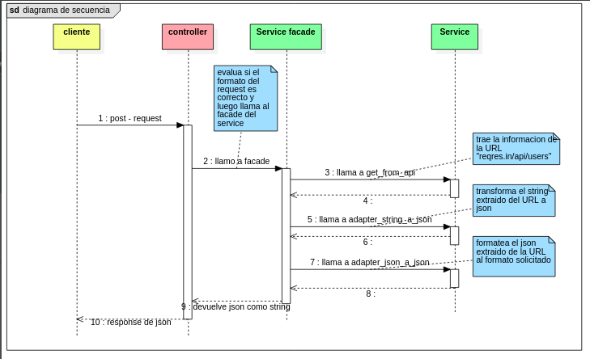

# - Reto tecnico Entelgy
- Desarrollar un programa que re-formate la estructura json: (las lineas suspensivas indican que hay ___n___ elementos en la lista)

de este formato 
```json
{
    "page": 1,
    "per_page": 6,
    "total": 12,
    "total_pages": 2,
    "data": [
        {
            "id": 1,
            "email": "george.bluth@reqres.in",
            "first_name": "George",
            "last_name": "Bluth",
            "avatar": "https://reqres.in/img/faces/1-image.jpg"
        },
        ... <============== mas elementos
    ],
    "support": {
        "url": "https://reqres.in/#support-heading",
        "text": "To keep ReqRes free, contributions towards server costs are appreciated!"
    }
}
```
a este formato
```json
{
  "data": [
    "1|Bluth|george.bluth@reqres.in",
    ... <============== mas elementos
  ]
}
```
- el json a formatear debe de consumirse de la siguiente URL https://reqres.in/api/users. Esta debe ser consumida desde el archvo properties del backend.
- Tambien se solicita que se aplique testeo de las funciones.
# - Funcionamiento

- el cliente envia un post con su respectivo request
- el controller recibe el request en forma de string. Evalua si tiene el formato correcto. Para este ejercicio se define que el formato del request del cliente debe ser el siguiente
```json
{
    "accion":"si"
}
```
- Si todo esta bien, el controller le pasa al service la URL a consumir (https://reqres.in/api/users) desde el archivo properties.
- service tiene una funcion que sigue el patron de diseño "facade". Esta funcion llama a tres otras funciones:
  - __get_from_api__: hace un get a la URL entregada como parametro y devuelve un string
  - __adapter_string_a_json__: sigue el patron de diseño "adapter". Recibe un string y lo transforma a json.
  - __adapter_json_a_json__: tambien sigue el patron de diseño "adpater". Su funcion es la de convertir el formato json de la URL consumida a al formato json solicitado.
- una vez finalizado, la funcion facade devuelve el string al controller y este a su vez lo envia como response al cliente.

# - Testing
Se usa junit y las librerias de spring test para evaluar el correcto funcionamiento del programa

- __RetoTecnicoApplicationTests.java__: Se evalua con los metodos _assert_ que las funciones de la clase _RetoService_ esten funcionando correctamente
- __HttpRequestTest.java__: se testea el controller. Se revisa que la respuesta de los metodos get y post (sobre todo post) es la esperada.
# - Estructura del proyecto
```
|-- reto-tecnico-entelgy (repositorio)
    |-- README.md (documentacion)
    |-- reto-tecnico (backend)
        |-- pom.xml (dependencias del proyecto)
        |-- src
            |-- main/java/com/entelgy/retotecnico
                |-- RetoController (controllador)
                |-- RetoService (servicio)
            |-- test/java/com/entelgy/retotecnico
                |-- RetoTecnicoApplicationTests.java (test al servicio con junit)
                |-- HttpRequestTest.java (test al controller con spring test)
```
# - Despliegue
```bash
cd (ubicacion del repo)/reto-tecnico

./mvnw spring-boot:run
./mvnw test
```

# - Referencia
- Spring initializer (oficial) [link](https://start.spring.io/)
- Guias oficiales de spring (oficial) [link](https://spring.io/guides)
- arquitectura spring (no oficial) [link](https://anchormen.nl/blog/big-data-services/spring-boot-tutorial/)
## -- @service
- https://spring.io/guides/gs/contract-rest/
- https://spring.io/guides/gs/cloud-circuit-breaker/
- https://spring.io/guides/gs/testing-web/
- https://spring.io/guides/gs/multi-module/

## -- application.properties
- https://spring.io/guides/gs/uploading-files/
- https://spring.io/guides/gs/accessing-data-neo4j/
- https://spring.io/guides/gs/actuator-service/
- https://spring.io/guides/gs/service-registration-and-discovery/
- https://spring.io/guides/gs/multi-module/
- https://spring.io/guides/gs/messaging-gcp-pubsub/
- https://spring.io/guides/gs/spring-cloud-loadbalancer/
- https://spring.io/guides/gs/cloud-circuit-breaker/
- https://spring.io/guides/gs/accessing-data-cassandra/
## -- @Autowired
- https://spring.io/guides/gs/relational-data-access/
- https://spring.io/guides/gs/spring-boot/
- https://spring.io/guides/gs/crud-with-vaadin/
- https://spring.io/guides/gs/testing-restdocs/
- https://spring.io/guides/gs/accessing-data-mysql/
- https://spring.io/guides/gs/reactive-rest-service/
- https://spring.io/guides/gs/accessing-vault/
- https://spring.io/guides/gs/gateway/

## -- @Bean
- https://spring.io/guides/gs/messaging-rabbitmq/
- https://spring.io/guides/gs/messaging-jms/
- https://spring.io/guides/gs/securing-web/
- https://spring.io/guides/gs/accessing-data-gemfire/
- https://spring.io/guides/gs/spring-boot/
- https://spring.io/guides/gs/consuming-web-service/
- https://spring.io/guides/gs/crud-with-vaadin/
- https://spring.io/guides/gs/caching-gemfire/
## -- @Component
- https://spring.io/guides/gs/scheduling-tasks/
- https://spring.io/guides/gs/messaging-rabbitmq/
- https://spring.io/guides/gs/messaging-jms/
- https://spring.io/guides/gs/async-method/
- https://spring.io/guides/gs/caching/
- https://spring.io/guides/gs/reactive-rest-service/
- https://spring.io/guides/gs/spring-data-reactive-redis/

## -- Baeldung
- [diferencia entre @Component y @Bean](https://www.baeldung.com/spring-component-annotation)
- [@PostContruct](https://www.baeldung.com/spring-postconstruct-predestroy)
- [Serialization](https://www.baeldung.com/spring-boot-jsoncomponent)
- [@Scheduled](https://www.baeldung.com/spring-scheduling-annotations)
- [Get all beans](https://www.baeldung.com/spring-show-all-beans)